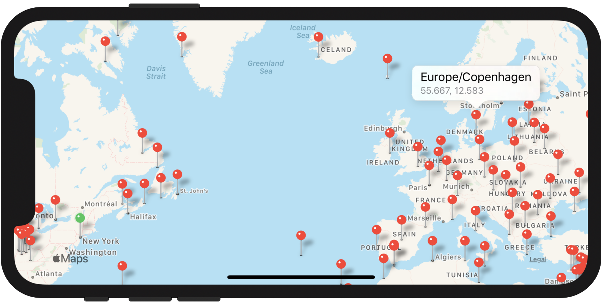

# NSTimeZone+Coordinate

Adds a `coordinate` property to `NSTimeZone` — useful in situations where location permission has not yet been granted, has been refused, or can’t be requested.

These coordinates are derived from the [IANA’s Time Zone database](https://www.iana.org/time-zones) and represent the largest populated place within a given time zone (_not_ the centroid).



## Usage

```objc
CLLocationCoordinate2D coordinate = NSTimeZone.localTimeZone.coordinate;

NSLog(@"%@: %f, %f", NSTimeZone.localTimeZone, coordinate.latitude, coordinate.longitude);
// → Local Time Zone (America/New_York (EDT) offset -14400 (Daylight)): 40.714000, -74.006000
```

To set the center coordinate of a map view (e.g., using the [Mapbox iOS SDK](https://www.mapbox.com/ios-sdk/)):

```objc
CLLocationCoordinate2D coordinate = NSTimeZone.localTimeZone.coordinate;
if (CLLocationCoordinate2DIsValid(coordinate)) {
    [self.mapView setCenterCoordinate:coordinate];
}
```

Be sure to check that the returned coordinate is valid, as it is possible that this category may not find a coordinate for a given time zone.

See the [demo project](./TZCoordinateDemo) for more information about usage and available time zones.

## Installation

### Manual

Copy [`NSTimeZone+Coordinate.h/m`](./NSTimeZone+Coordinate) and [`timezones.plist`](./NSTimeZone+Coordinate/timezones.plist) to your project. Make sure `timezones.plist` is bundled with your application.

_Note: [`timezones.xml.plist`](./NSTimeZone+Coordinate/timezones.xml.plist) is not used by this category — it exists so changes can be easily diffed._

### CocoaPods

To integrate this category with [CocoaPods](https://cocoapods.org/pods/NSTimeZone-Coordinate), add this to your Podfile:

```ruby
pod 'NSTimeZone-Coordinate'
```

## Updating

1. `npm run update` — updates the timezone submodule and regenerates the plists.
2. Commit the new submodule commit hash and the changes to the binary and XML plist files.
